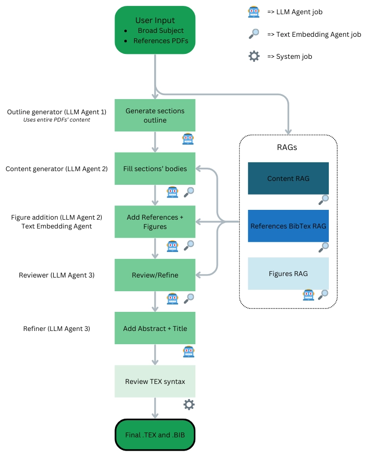

# AI Survey Writer

An approach to automating the process of writing Survey Papers using state-of-the-art LLMs.

## Usage:

This tool can be used directly from the terminal. 


### Installation 

```
git clone https://github.com/juliokscesar/aisurveywriter.git
cd aisurveywriter
pip install -e .
```

And then you can run it using 
```
python -m aisurveywriter
```

### Example usage (CLI)
The only two positional arguments are "references_dir" and "subject", respectively, and the two most useful optional arguments are "--llm-model (-m)" and "--llm (-l)". 

For example, to generate a paper on the subject "Langmuir and Langmuir-Blodgett films" with PDF references in the directory "./refexamples", using Google's gemini-2.0-pro-exp, it's simply done by:

```
python -m aisurveywriter -l google -m gemini-2.0-pro-exp ./refexamples "Langmuir and Langmuir-Blodgetts films"
```

CLI help:
```
usage: python -m aisurveywriter [-h] [--save-dir SAVE_DIR] [--llm {openai,google}] [--llm-model LLM_MODEL] [--credentials CREDENTIALS] [--structure STRUCTURE] [--paper PAPER] [--embed-model EMBED_MODEL] [--embed-type EMBED_TYPE] [--bibdb BIBDB] [--faissbib FAISSBIB] [--images IMAGES]
                   [--faissfig FAISSFIG] [--faissref FAISSREF] [--no-ref-rag] [--no-figures] [--no-reference] [--no-abstract] [--no-tex-review] [--no-review] [--cooldown COOLDOWN] [--embed-cooldown EMBED_COOLDOWN] [--tex-template TEX_TEMPLATE]
                   references_dir subject

positional arguments:
  references_dir        Path to directory containg all PDF references
  subject               Main subject of the survey. Can be the Title too

options:
  -h, --help            show this help message and exit
  --save-dir SAVE_DIR   Path to output directory
  --llm {openai,google}, -l {openai,google}
                        Specify LLM to use. Either 'google', 'openai' or 'ollama'. Default is google
  --llm-model LLM_MODEL, -m LLM_MODEL
                        Specific LLM model to use. Default is gemini-2.0-flash
  --credentials CREDENTIALS
                        YAML file containing your API keys
  --structure STRUCTURE, -s STRUCTURE
                        JSON file containing the structure to use. If provided, this will skip the structure generation process.
  --paper PAPER, -p PAPER
                        Path to .TEX paper to use. If provided, won't write one from the structure, and will skip directly to reviewing it (unless --no-review) is provided
  --embed-model EMBED_MODEL, -e EMBED_MODEL
                        Text embedding model name
  --embed-type EMBED_TYPE, -t EMBED_TYPE
                        Text embedding model type (google, openai, huggingface)
  --bibdb BIBDB, -b BIBDB
                        Path to .bib database to use. If none is provided, one will be generated by extracting every reference across all PDFs
  --faissbib FAISSBIB, -fb FAISSBIB
                        Path to FAISS vector store of the .bib databse. If none is provided, one will be generated
  --images IMAGES, -i IMAGES
                        Path to all images extracted from the PDFs. If none is provided, all images will be extracted and saved to a temporary folder
  --faissfig FAISSFIG, -ff FAISSFIG
                        Path to FAISS vector store containing the metadata (id, path and description) for every image. If none is provided, one will be created
  --faissref FAISSREF, -fr FAISSREF
                        Path to FAISS of references contents to retrieve only a piece of information, instead of sending the entire document.
  --no-ref-rag          Don't create a RAG for reference contents. Use entire PDF instead
  --no-figures          Skip step of adding figures to the written paper.
  --no-reference        Skip step of adding references to the text
  --no-abstract         Skip step of writing Abstract and Title
  --no-tex-review       Skip TEX review
  --no-review           Skip content/writing review step
  --cooldown COOLDOWN, -w COOLDOWN
                        Cooldown between two consecutive requests made to the LLM API
  --embed-cooldown EMBED_COOLDOWN
                        Cooldown between two consecutive requests made to the text embedding model API
  --tex-template TEX_TEMPLATE
                        Path to custom .tex template
```

### Example usage (Gradio Interface)
There's a [gradio](https://www.gradio.app/docs) interface built around this tool, just a quick wrapper around the CLI usage. To run it, execute:
```
python -m aisurveywriter.interface
```

and then you can access it at "localhost:7860" in your browser.

## Flowchart


## Step-by-step details

### Step 0: Creating RAGs  

Before writing each section of the paper, we first generate three distinct **Resource Augmented Generation (RAG)** databases. These databases are essential for retrieving relevant information in later steps.  

Each RAG is a **vector database** built using **FAISS** for efficient similarity-based search.  

1 - **Content RAG**  
This database stores vector embeddings of all content extracted from the reference PDFs provided by the user. It serves as a knowledge source when the LLM needs to retrieve relevant information for different sections.  

- The retrieval process is based on a query containing the section description.  
- The query is used to fetch the top **k** most relevant content chunks from the database.  
- This approach significantly reduces token usage per request while ensuring the LLM focuses only on relevant content for each section.  

2 - **References BibTeX RAG**  
This database is used to retrieve **BibTeX entries** based on their similarity to abstracts and keywords. It is created in three steps:  
  1. Extract the bibliography section from each reference PDF.  
  2. Use an LLM to identify the **titles and authors** of all cited works.  
  3. Retrieve corresponding BibTeX entries using the **[Crossref API](https://www.crossref.org/)**.  

After retrieval, duplicate entries are filtered out, and the final vector database stores each entry’s **DOI, title, abstract, and keywords** for efficient lookup.  

3 - **Figures RAG**  
This database contains images extracted from all reference PDFs, each paired with a unique ID and a descriptive caption.  

- The description is generated by an **LLM agent**, which processes both the image (in base64 format) and relevant surrounding text from the PDF.  
- This allows for easy retrieval of images based on semantic similarity.  

**Embedding Model & Similarity Threshold**  
To generate and query these RAGs, a **text embedding model** is required. The best results were achieved using **[Snowflake's Arctic-embed-l-v2.0](https://huggingface.co/Snowflake/snowflake-arctic-embed-l-v2.0)**.  

Additionally, a **confidence threshold** of **0.9** is applied during similarity search—if a retrieved item's score is below 0.9, it is discarded to ensure high relevance.  

### Step 1: Generating the Sections Outline  

This step establishes the initial structure of the paper. To ensure the outline aligns perfectly with the entire content, we use an **LLM agent** that processes the full text of all reference PDFs **without using RAG**.  

Since this requires handling a large amount of text, a model with a **large context window** is necessary. The best results were achieved using **Google's Gemini-2.0-Flash** model for this step.  

**Output Format**  
The LLM generates a **JSON object** containing a list under the key `"sections"`. Each item in this list represents a section and includes the following keys:  

- **`title`** – The section title.  
- **`description`** – A brief overview of the section, often including a breakdown of its subsections.  

This structured output serves as the foundation for the paper, guiding the subsequent content generation steps.  


### Step 2: Generating Section Content  

With the structured outline from **Step 1**, we now generate the content for each section using a second **LLM agent**.  

**Process**  
For each section:  
1. The **section description** (from Step 1) is used as a query to retrieve **k** relevant text chunks from the **Content RAG** via similarity search.  
2. The **LLM agent** then generates the section’s content based on the retrieved information.  

**Optimal Parameters**  
- The best results were achieved using **Google's Gemini-2.0-Pro-Exp** model.  
- The optimal number of retrieved chunks (**k**) was found to be **30**.  

This approach ensures that each section is written with highly relevant, context-aware information while maintaining coherence with the overall paper structure.  


### Step 3: Adding References & Figures  

Once each section has been written, we enhance the content by incorporating **figures** and **references**.  

**Adding Figures**  
1. Each **completed section** is processed by an **LLM agent**, which analyzes its content alongside the full reference PDFs.  
2. If a visual element is relevant, the LLM generates a **LaTeX figure block** containing:  
   - The **figure name**  
   - A **caption** based on a referenced figure  
3. Using the **Figures RAG**, a **similarity search** is performed with the generated caption to find the most relevant image.  
4. The **local path** of the best-matching image is then added to the LaTeX figure block.  

**Adding References**  
1. Each **sentence** in the section is used as a query to retrieve the most relevant **BibTeX entries** from the **References BibTeX RAG**.  
2. The corresponding citations are then inserted into the text at appropriate locations.  

This step ensures that the paper is well-supported with relevant figures and properly formatted references.  


### Step 4: Review & Refinement  

This step focuses on improving the initial draft by refining its content. It is divided into two substeps:  

**1. Obtaining Review Directives**  
For each section:  
- The **section content** and **k** relevant text chunks from the **Content RAG** are provided to an **LLM agent**.  
- The LLM analyzes the text and generates **review directives**, suggesting improvements such as:  
  - Expanding on certain topics  
  - Adding more detail or clarification  
  - Enhancing discussions related to figures  

**2. Applying Review Directives**  
- The **review directives** are then sent to another **LLM agent** (or the same one).  
- Along with the same **k** retrieved chunks, the agent updates the content to incorporate the suggested refinements.  

This iterative process ensures that the paper is **well-structured, detailed, and polished** before finalization.  


### Step 5: Add Abstract + Title

With the entire paper now written and refined, we send it's content to an LLM agent and ask it to write the abstract and produce a title.

### Step 6: Review TEX Syntax

This step is entirely done by the system, i.e. only using built-in functionality from Python or related libraries, such as bibtexparser and regex. This filters elements such as Markdown code block's (like "\`\`\`latex") that LLMs tend to add in the response, and invalid citation keys used.

### Final paper

The output is the final paper .tex and .bib, already with all LaTeX configuration set, including the images path and the .bib path. So it's conveniently easy to just run `pdflatex survey` and produce the PDF.
